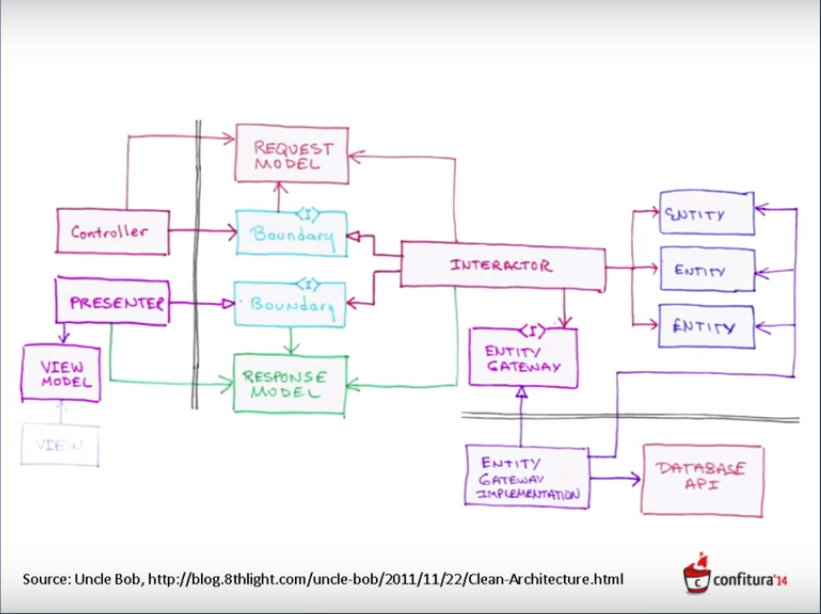

#Old school, Anemic Domain Model
- Przegląd projektu
- Request flow a zależności między projektami
- Anemic Domain Model
- Problemy z testowalnością
- Naginanie kod pod wymagania frameworków

#Koncepcja Clean Architecture
- Diagram koncepcyjny 
- Diagram UML draw.io
- CA w projekcie Library
    + Struktura solucji
        * zależności pomiędzy projektami
    + Struktura projektu Core 
        * Domain Model, ModelFactory
        * Gateway, IRepository
        * Boundary
            - Request: IUseCase, Command
            - Response: IPresenter, Confirmation
        * Implementacja IUseCase

#Separation of Concers
- Model persystenty czy nie
- CA, Hexagonal Arch., Port & Adapters, Onion Arch.

#Testowalność
- Domain Test - odkąd, dokąd?
- UseCase, Scenario, Given-When-Then
- Implementacja kroków Given-When-Then
- xUnit Patterns: ObjectMother

#Architektura UI
- Kontrolki gadają z kontrolkami
    + Referencje wszycy-do-wszystkich - coupling, bałagan
    + Wszyscy do mediatora - bałagan w jednym miejscu, sztywne bardzo
    + Observers wszyscy-do-wszystkich - jeszcze większy bałagan, testowanie
    + Zdarzenia wszyscy-do-wszystkich - masakryczny bałagan, błąd szybkiego entera
- Bounded Context w odniesieniu do UI
- Sync-async
- 
- Granulacja
- Logika na UI
    + Jaka? Walidacja?
    + Screen state, session state, record state
    + UI - osobna app
